# Task 0

## Introduction to GTest

We specify test cases in GTest as follows. The statement EXPECT_EQ(add(2, 4), 6) means that we expect the two arguments, 6 and add(2, 4), to be equal. This is kind of similar to a statement like "assert 2 + 4 == 6"

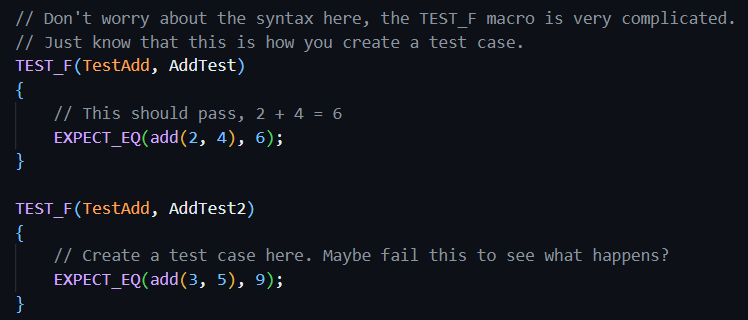

We assert 3 + 5 == 9 which will cause the test to fail, just to see the result.

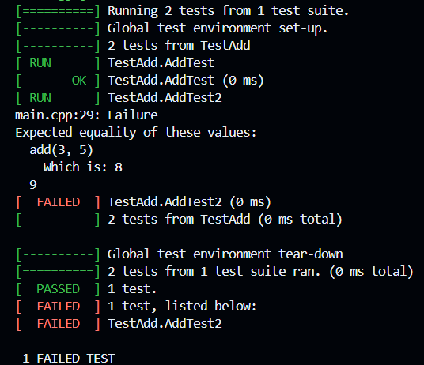

# Task 1

## Linear Feedback Shift Register

We first want to implement a 4-bit linear feedback shift register (0-indexed). So on every clock cycle, each bit shifts to the right by one flip flop, such that bit 0 goes to bit 1, bit 1 goes to bit 2, etc. Additionally, on each clock cycle, we also want to take the value of bit 2 and bit 3 (the 2 MSBs), XOR them, and pass them back to bit 0 so bit 0 will be updated to that value on the next cycle. Hence it is a linear feedback shift register.

This is implemented in system verilog as follows. See comments for details.

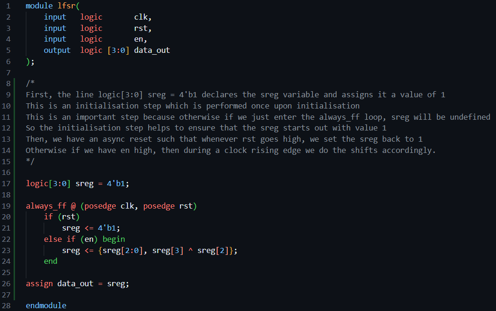

We then run the tests using verify.sh which uses the verify.cpp testbench. It tests the reset signal, and additionally, it simply steps through the simulation one cycle at a time, and at each cycle, it verifies whether the data_out matches the expected value.

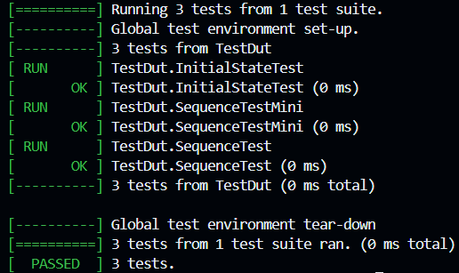

## Extension to 7-bit LFSR

We now want to extend the linear feedback shift register to 7 bits. We want to implement the 7-bit LFSR using a primitive polynomial 1 + X^3 + X^7. This will enable the shift register to cycle over all 128 values. 

Suppose the 7-bit shift register gives the 7-bit number X[7:1] (1-indexed). X^3 indicates bit 3 i.e. X[3] and X^7 indicates X[7]. So from the primitive polynomial we have 1 + X[3] + X[7] = 0. Since this is binary addition (modulo 2), we have X[3] + X[7] = 1. We can then write 1 = X[0], such that X[0] = X[3] + X[7].

Hence, from this equation, we can implement the LFSR such that on each clock cycle, we shift bits 6:0 to 7:1, and then we XOR bit 3 and bit 7 and pass it as input to X[1], the LSB. We implement it as follows:

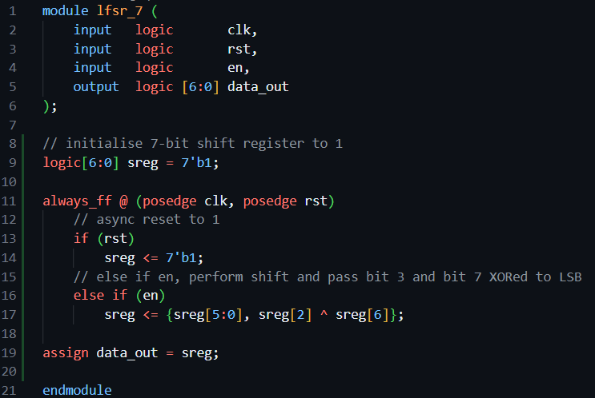

Again, we run the unit tests, which cycle over all 128 elements and check if the output is equal to the expected value.

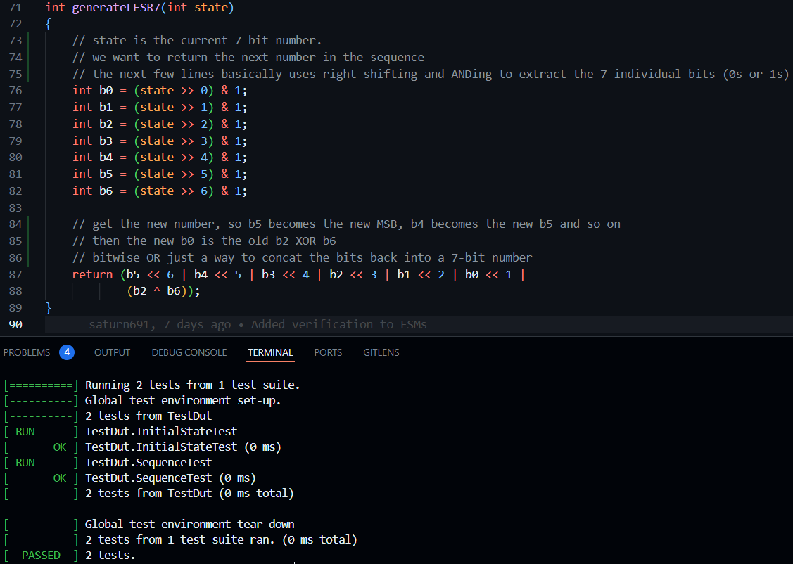

# Task 2

## Formula 1 Light Sequence FSM

We now want to implement a FSM that cycles through a sequence of states. We start from the idle state 00000000, then we go to 00000001, 00000011, 00000111 etc until we reach 11111111, and then we go back to all 0s. The Moore diagram of the state machine is shown as follows:

We implement the FSM in system verilog as follows. See comments for details

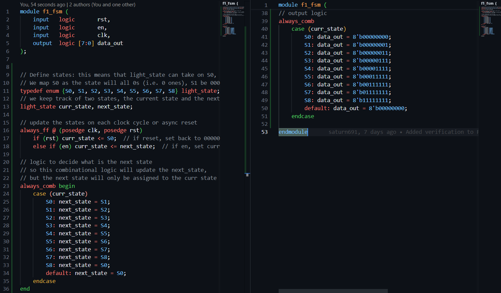

This gives us the following test output. Again the tests is just cycling through the sequence to verify that the output matches the expected.

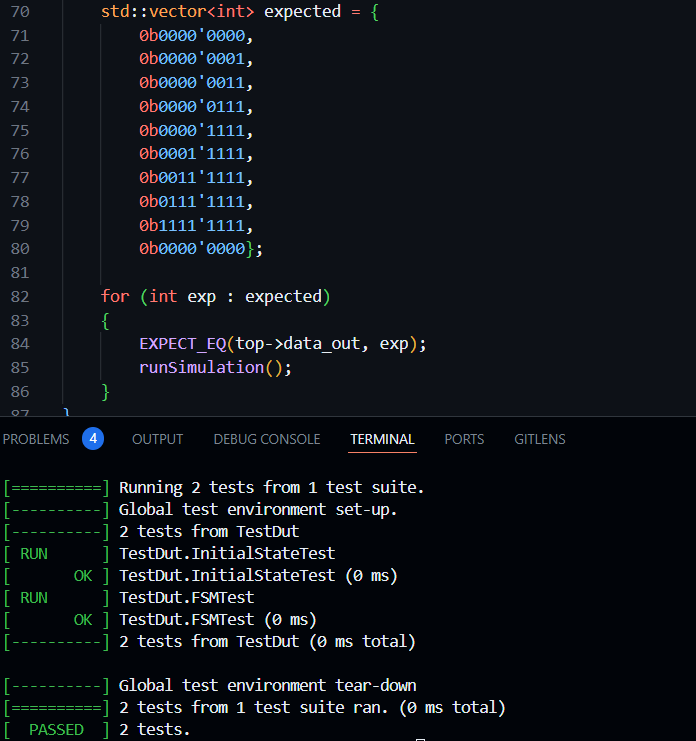

## Interface with VBuddy light strip

Next we want to connect the FSM to vbuddy. We want to use the switch on the rotary encoder with vbdFlag() set to mode 1 i.e. single-shot mode. Recall this is the mode where pressing the switch will set vbdFlag() to 1, then after we read it, it will immediately go back to 0. We can then use the vbdFlag() value as the en input, such that whenever we press the switch and read the flag value, the fsm will go to the next state, then afterwards vbdFlag() will go back to 0 so the FSM stays until we press the switch again.

We implement the testbench to interface with Vbuddy as follows. See comments for details

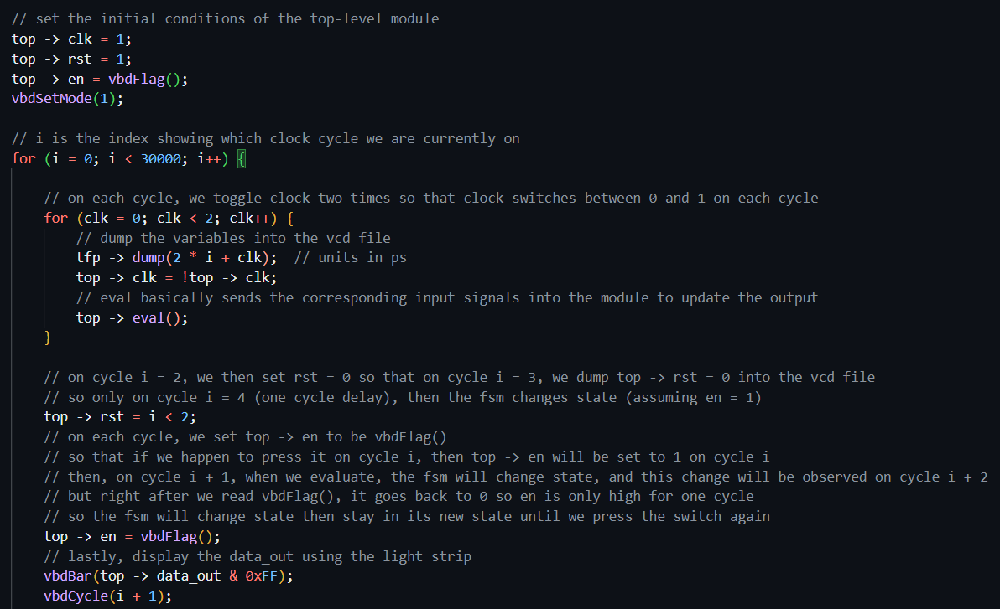

This gives us the following output. When we press the switch, the lights light up one by one until all 8 are lighted up, then it goes back to no lights.

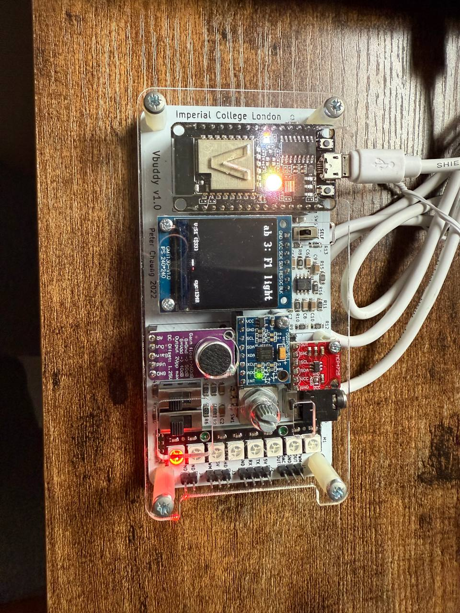
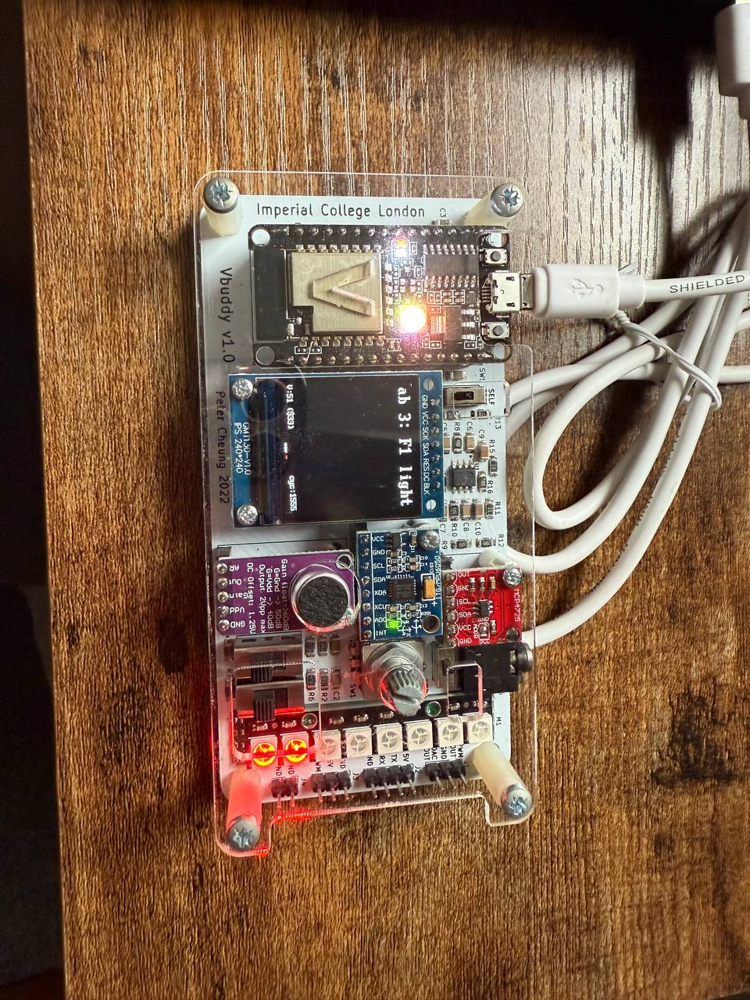
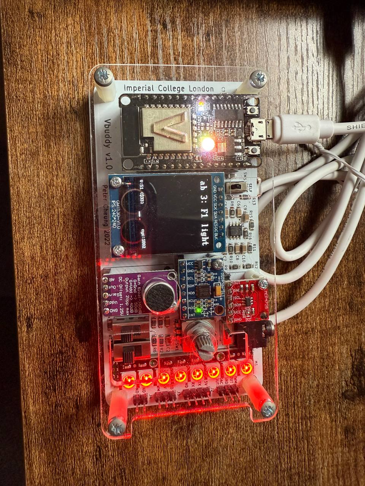
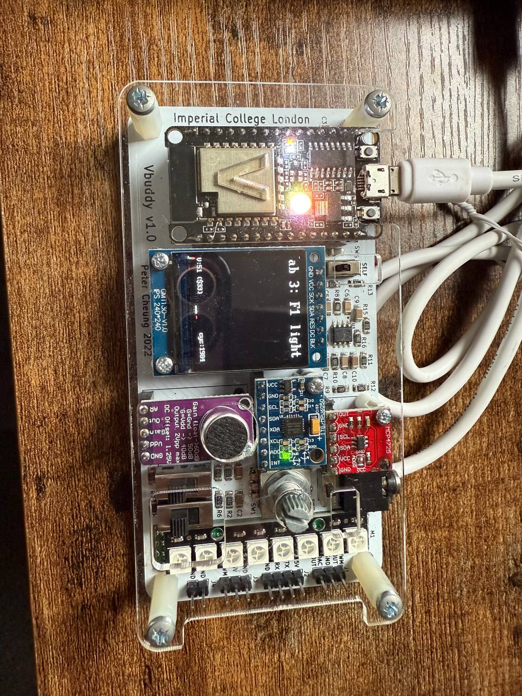

# Task 3

## ClkTick Module

We start with clktick.sv, which is a module that takes in a clock as well as an input N, and then it outputs a pulse lasting for one cycle every N + 1 cycles. This is implemented as follows. See comments for details

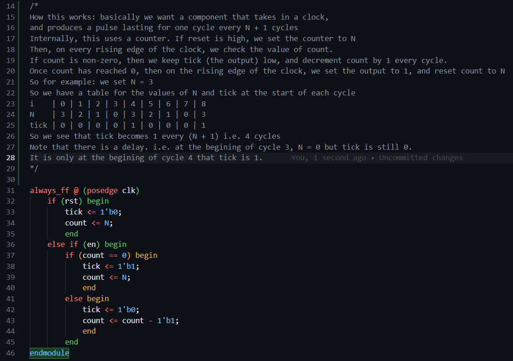

Next we have the clktick test bench. How this works is that we set top -> N to be vbdValue(), the value of the rotary encoder. So every cycle, we do the evaluation, which means that top -> tick will go high every N + 1 cycles. And then whenever top -> tick is high, we toggle the variable `lights` between 00000000 and 11111111, i.e. switching on and off all 8 lights. So e.g. if N is set to 49, then every 50 cycles, the lights will toggle. 

The goal then is to rotate the rotary encoder (thus adjusting N), until we observe that the lights toggle at a rate of 1s (i.e. top - tick goes high every 1s). Upon simulation, we see that setting vbdValue to 42 allows us to toggle the lights at a rate of approximately 1s (by syncing with a metronome set to 60 bpm).

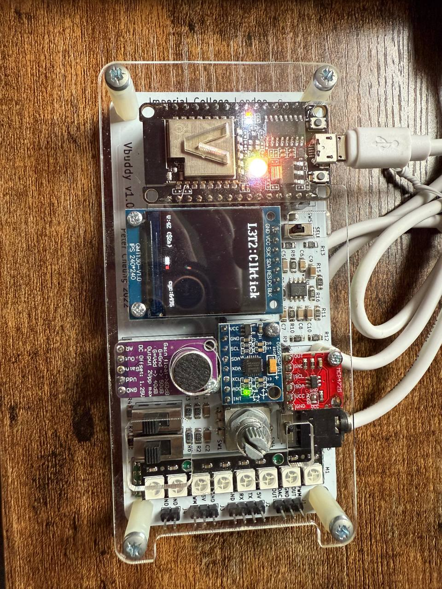
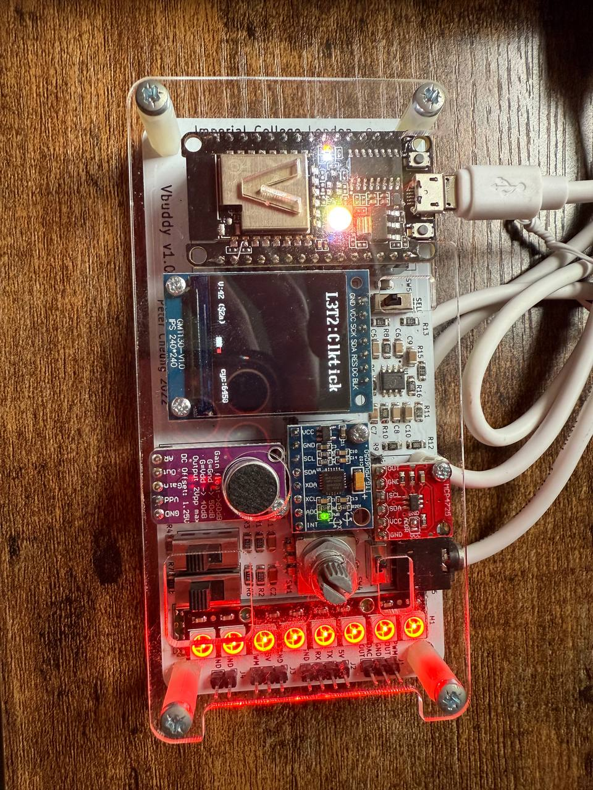

## Combining Clktick and F1 FSM

We now want to combine clktick.sv with f1_fsm.sv so that the F1 light sequence cycles through automatically with 1s delay per state transition, as follows:

Basically, we want to pass in the tick output of clktick.sv as the enable input of f1_fsm.sv. So that suppose in cycle i, if clktick outputs tick = 1, then on the next clock rising edge (i.e. cycle i + 1), the enable input is 1, hence the fsm state will be updated on cycle i + 1, thus updating the data_out.

We do this simply by passing in the tick output of clktick.sv as the enable input of f1_fsm.sv, as follows:

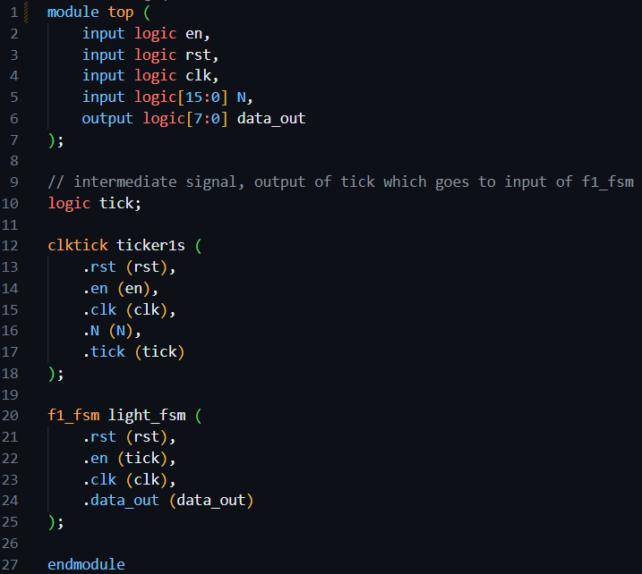

Next, we just need a simple testbench. Internally, the clktick module will output a tick every N + 1 cycles, thus causing the state to change, and thus data_out to change on the next cycle. Hence, all we need to do is to simply pass in the value of data_out to the vbdBar to set the state of the lights, as follows:

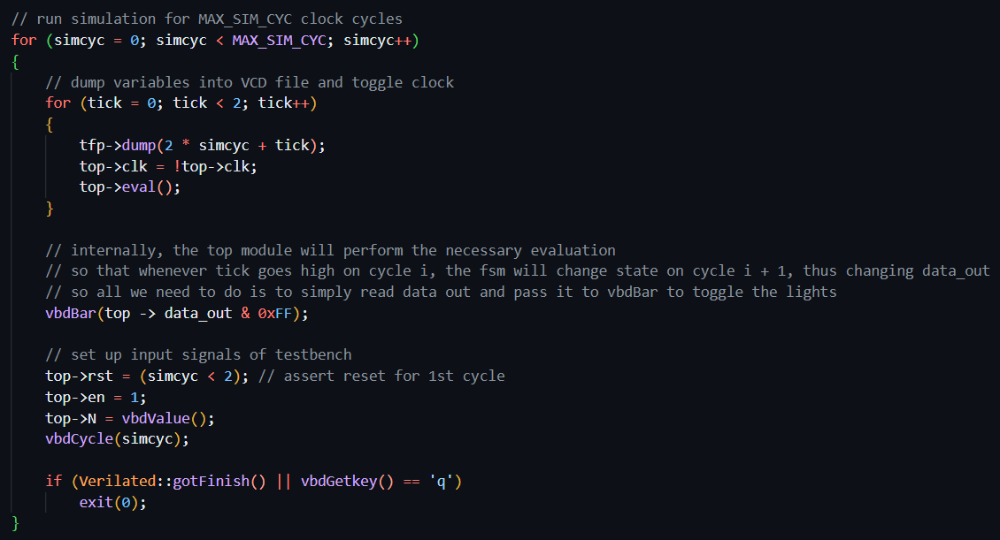

This gives us the following output. We can see that the FSM state changes every approximately 1 second.

