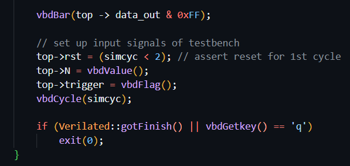

# Task 0

## Introduction to GTest

We specify test cases in GTest as follows. The statement EXPECT_EQ(add(2, 4), 6) means that we expect the two arguments, 6 and add(2, 4), to be equal. This is kind of similar to a statement like "assert 2 + 4 == 6"

We assert 3 + 5 == 9 which will cause the test to fail, just to see the result.

# Task 1

## Linear Feedback Shift Register

We first want to implement a 4-bit linear feedback shift register (0-indexed). So on every clock cycle, each bit shifts to the right by one flip flop, such that bit 0 goes to bit 1, bit 1 goes to bit 2, etc. Additionally, on each clock cycle, we also want to take the value of bit 2 and bit 3 (the 2 MSBs), XOR them, and pass them back to bit 0 so bit 0 will be updated to that value on the next cycle. Hence it is a linear feedback shift register.

This is implemented in system verilog as follows. See comments for details.

We then run the tests using verify.sh which uses the verify.cpp testbench. It tests the reset signal, and additionally, it simply steps through the simulation one cycle at a time, and at each cycle, it verifies whether the data_out matches the expected value.

## Extension to 7-bit LFSR

We now want to extend the linear feedback shift register to 7 bits. We want to implement the 7-bit LFSR using a primitive polynomial 1 + X^3 + X^7. This will enable the shift register to cycle over all 128 values. 

Suppose the 7-bit shift register gives the 7-bit number X[7:1] (1-indexed). X^3 indicates bit 3 i.e. X[3] and X^7 indicates X[7]. So from the primitive polynomial we have 1 + X[3] + X[7] = 0. Since this is binary addition (modulo 2), we have X[3] + X[7] = 1. We can then write 1 = X[0], such that X[0] = X[3] + X[7].

Hence, from this equation, we can implement the LFSR such that on each clock cycle, we shift bits 6:0 to 7:1, and then we XOR bit 3 and bit 7 and pass it as input to X[1], the LSB. We implement it as follows:

Again, we run the unit tests, which cycle over all 128 elements and check if the output is equal to the expected value.

# Task 2

## Formula 1 Light Sequence FSM

We now want to implement a FSM that cycles through a sequence of states. We start from the idle state 00000000, then we go to 00000001, 00000011, 00000111 etc until we reach 11111111, and then we go back to all 0s. The Moore diagram of the state machine is shown as follows:

We implement the FSM in system verilog as follows. See comments for details

This gives us the following test output. Again the tests is just cycling through the sequence to verify that the output matches the expected.

## Interface with VBuddy light strip

Next we want to connect the FSM to vbuddy. We want to use the switch on the rotary encoder with vbdFlag() set to mode 1 i.e. single-shot mode. Recall this is the mode where pressing the switch will set vbdFlag() to 1, then after we read it, it will immediately go back to 0. We can then use the vbdFlag() value as the en input, such that whenever we press the switch and read the flag value, the fsm will go to the next state, then afterwards vbdFlag() will go back to 0 so the FSM stays until we press the switch again.

We implement the testbench to interface with Vbuddy as follows. See comments for details

This gives us the following output. When we press the switch, the lights light up one by one until all 8 are lighted up, then it goes back to no lights.

# Task 3

## ClkTick Module

We start with clktick.sv, which is a module that takes in a clock as well as an input N, and then it outputs a pulse lasting for one cycle every N + 1 cycles. This is implemented as follows. See comments for details

Next we have the clktick test bench. How this works is that we set top -> N to be vbdValue(), the value of the rotary encoder. So every cycle, we do the evaluation, which means that top -> tick will go high every N + 1 cycles. And then whenever top -> tick is high, we toggle the variable `lights` between 00000000 and 11111111, i.e. switching on and off all 8 lights. So e.g. if N is set to 49, then every 50 cycles, the lights will toggle. 

The goal then is to rotate the rotary encoder (thus adjusting N), until we observe that the lights toggle at a rate of 1s (i.e. top - tick goes high every 1s). Upon simulation, we see that setting vbdValue to 42 allows us to toggle the lights at a rate of approximately 1s (by syncing with a metronome set to 60 bpm).

## Combining Clktick and F1 FSM

We now want to combine clktick.sv with f1_fsm.sv so that the F1 light sequence cycles through automatically with 1s delay per state transition, as follows:

Basically, we want to pass in the tick output of clktick.sv as the enable input of f1_fsm.sv. So that suppose in cycle i, if clktick outputs tick = 1, then on the next clock rising edge (i.e. cycle i + 1), the enable input is 1, hence the fsm state will be updated on cycle i + 1, thus updating the data_out.

We do this simply by passing in the tick output of clktick.sv as the enable input of f1_fsm.sv, as follows:

Next, we just need a simple testbench. Internally, the clktick module will output a tick every N + 1 cycles, thus causing the state to change, and thus data_out to change on the next cycle. Hence, all we need to do is to simply pass in the value of data_out to the vbdBar to set the state of the lights, as follows:

This gives us the following output. We can see that the FSM state changes every approximately 1 second.

# Task 4

Finally we want to combine the multiple components together to create the full version of the F1 light design as follows:

The clktick module is as before, the output tick goes high for 1 pulse every approximately 1 second. A new block delay.sv is provided (see lecture 5 slides 16 and 17). How it works is that once it detects the rising edge on the input trigger, it will wait for n clock cycles before producing a 1-cycle pulse on time_out. The state diagram of delay.sv is as follows:

Broad overview: Initially the FSM is in the idle state and output is 0. Once the trigger goes high, it will shift to the counting state and start counting down from n - 1. Once the count reaches 0, it will go into the time_out state where the output is 1 for one cycle. After being in the time_out state for one_cycle, if the trigger is low, it will go back into the idle state and listen for the next rising trigger. Else if the trigger remains high, it will move into wait_low and wait for the trigger to go low before it goes back into the idle state. This means that the FSM can only be triggered again (i.e. shift into the counting state) after the trigger has returned to 0.

With reference to the full F1 circuit diagram, we need to modify the f1_fsm.sv module such that it takes in a trigger input. This trigger input will be controlled by vbdFlag() which essentially kicks off the whole sequence and causes the lights to start lighting up one by one. Additionally, we also need the f1_fsm.sv to provide two additional outputs. cmd_seq will be high during the sequencing of data_out from 8'b1 to 8'hff, and cmd_delay which triggers the start of the delay.sv component. We also notice that the delay.sv takes in as input K, the output of a 7-bit LFSR which is a pseudo-random binary number.

## Overview of what happens in the full circuit

Hence, overall what happens in the full F1 circuit is that once we press the rotary encoder switch, it will trigger f1_fsm.sv and set cmd_seq to 1. This causes the MUX to transmit the tick output from clktick.sv. This serves as the enable input of f1_fsm.sv. Hence, after pressing the switch, the effect is that the F1 lights start to light up one by one, every approximately 1 second. Then once all 8 lights have been lighted up, cmd_delay will be set to high. This causes the delay.sv component to start counting down from input K, which is a pseudo-random number. Additionally, cmd_seq will be set to 0, so that once delay.sv counts down to 0, time_out will go high for one cycle, triggering the enable of f1_fsm.sv and causing all lights to turn off.

Thus, the visual effect is that when we press the encoder switch, the lights light up one by one at 1 second intervals. Once all 8 have been lighted up, the circuit will wait for a random amount of time, then all lights will go off.

To implement this, we first need to change the f1_fsm.sv such that it depends on the trigger input to kick off the sequence, and then it has the two additional outputs cmd_seq and cmd_delay. Note that upon initialisation, we initialise cmd_seq and cmd_delay to 0. See comments for details

Now that we have edited the f1_fsm.sv, we just need to tie them up together in the top.sv, as follows:

The top.sv implementation is fairly straightforward. We just need to specify the internal signals cmd_seq and cmd_delay which are output from f1_fsm and fed back into clktick and delay respectively. We also declare the internal signals tick, prbs and time_out, which are the output of clktick, output of lfsr_7, and output of delay respectively. Finally, we implement the MUX using a simple ternary operator, where we pass in tick as the input to f1_fsm.en if cmd_seq = 1, else we pass in time_out.

Hence, overall to recap how it works, when we press the switch, we set cmd_seq to 1, after which we do not update cmd_seq anymore. This will enable clktick, thus causing clktick to produce a tick every 1 second. This also configures the MUX to transmit tick to the enable of f1_fsm, thus effectively causing the fsm to change state every second. Once we hit state 8 (all lighted up), we set cmd_seq back to 0 to disable clktick, and we set cmd_delay to 1 to trigger delay, and transmit time_out to f1_fsm.en, thus causing the fsm to go back to state 0 after a random number of cycles. Once it goes back to 0, cmd_delay and cmd_seq are both 0, hence we are back to the idle state and the cycle can begin again.

The last step is to interface the top module with the Vbuddy. 

The testbench is very straightforward. We simply need to update top -> N = vbdValue() and top -> trigger = vbdFlag() every cycle. Internally, the top level module already does all the updating of the variables, so we simply need to pass top -> data_out to vbdBar() to see the lights in action. The output is shown below, although the static images do not capture the timing information.

The last step is to perform the reaction time testing. To do this, we first initialise 2 variables before the start of the simulation, `in_sequence` and `is_timing`, to keep track of whether the fsm is currently in the counting sequence, and whether we are currently timing the interval between the lights out and the button press. We then add the following code to the testbench. See comments for details. Effectively, we want it to be such that if we press the rotary switch during the sequence, we don't want it to do anything. And after the lights go off, we want the first button press after the lights go off to stop the stopwatch, and not start a new sequence. Then, another button press starts a new sequence.

This gives the following reaction time displayed on the 7 segment display. The first one shows a faster reaction time of 0xCD milliseconds and the second image shows the measured time after letting it run for approximately 5 seconds.

